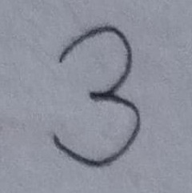
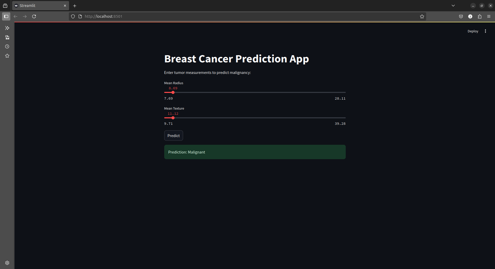

# Handwritten Digit Streamlit Classifier

An interactive Streamlit app that uses a trained TensorFlow model to recognize handwritten digits from the MNIST dataset.

## 🚀 Live Demo

👉 [Try the live app here](https://handwritten-digit-ai.streamlit.app/)

## 🎯 Features

- Predicts handwritten digits from uploaded 28×28 grayscale images
- Visualizes prediction probabilities as a bar chart
- Built-in preprocessing pipeline (inversion, normalization, flattening)
- Uses a trained multi-layer neural network (MLP with dropout)
- Streamlit interface for clean, responsive interactivity
- Ready for local development or public cloud deployment

## 🛠 Tech Stack

- Python 3
- TensorFlow
- Streamlit
- NumPy
- PIL (Python Imaging Library)

## 📂 Dataset

- MNIST Dataset: 70,000 images of handwritten digits
- Automatically downloaded via tensorflow.keras.datasets.mnist

## 📸 Screenshots

| Image Upload         | Model in Operation              | Prediction Result            |
|----------------------|---------------------------------|------------------------------|
|  |  |  |

## 🧪 Getting Started Locally

```bash
# Clone the repo
git clone https://github.com/justkimtai/handwritten-digit-ai.git
cd handwritten-digit-ai

# Create virtual environment (optional)
python3 -m venv venv
source venv/bin/activate

# Install dependencies
pip install -r requirements.txt

# Run app
streamlit run app.py
```

## 📦 Future Improvements

- 🖌 **Add Drawing Canvas**: Let users draw digits directly within the app using a Streamlit canvas.
- 📱 **Responsive Design**: Ensure a smooth, mobile-first experience with touch-friendly controls.
- 🌐 **Deployment Options**: Host the app on platforms like [Vercel](https://vercel.com/), [Render](https://render.com/), or [Railway](https://railway.app/) for free-tier accessibility.
- 📤 **Batch Prediction**: Allow users to upload and analyze multiple images at once.
- ✅ **Unit Tests & Validation**: Add a testing pipeline with `pytest` or `unittest` to ensure model and UI robustness.
- 🧠 **Model Optimization**: Compress and convert the model to TensorFlow Lite for faster web-based inference.
- 📊 **Performance Dashboard**: Add visualizations for prediction confidence and model metrics.

## 📄 License

This project is licensed under the **MIT License** — see the [LICENSE](LICENSE) file for details.

## 🙌 Acknowledgments

Special thanks to the open-source community and these key tools:

- [TensorFlow](https://www.tensorflow.org/) – powering the neural network.
- [Streamlit](https://streamlit.io/) – rapid UI development for machine learning apps.
- [MNIST Dataset](http://yann.lecun.com/exdb/mnist/) – the foundation dataset for digit recognition.
- [Matplotlib](https://matplotlib.org/) – for visualizing predictions and preprocessing.

## 🤝 Credits

This project was inspired by [DigitalOcean tutorials](https://www.digitalocean.com/community/tutorials) and built as part of my machine learning learning journey.

## 📩 Contact

Feel free to connect with me on [X (Twitter)](https://x.com/justkimtai) or [email](mailto:justkimtai@gmail.com) me for collaboration, freelance work, or opportunities!

---

> Built with ❤️ by [Justus Kimtai](https://github.com/justkimtai) — aspiring full-stack & AI engineer.
